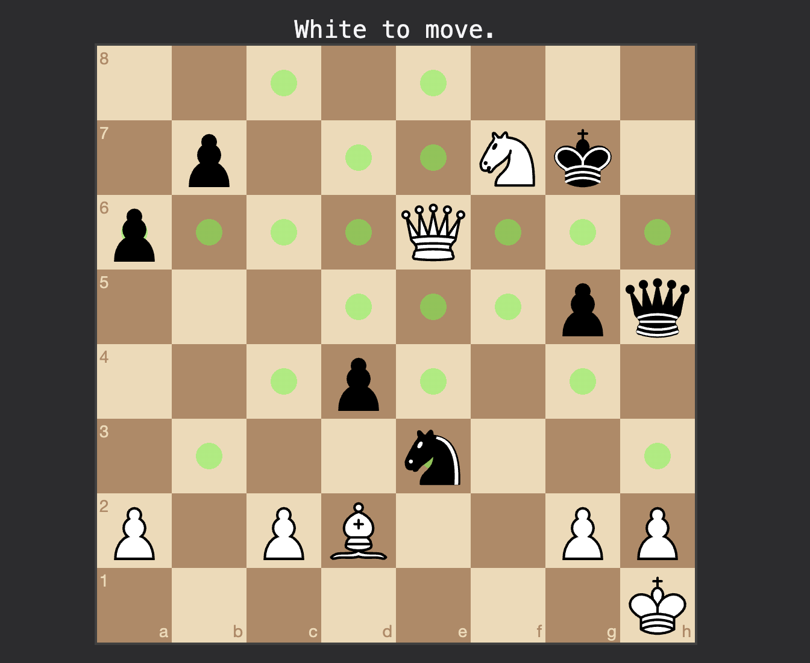

# Chess Puzzle Trainer

Minimal GitHub Pages version for my personal portfolio!

---

A desktop chess puzzle trainer featuring drag-and-drop piece movement, FEN-based puzzle loading, and move validation powered by [chess.js](https://github.com/jhlywa/chess.js) and [chessboard.js](https://github.com/oakmac/chessboardjs).



## Tasks

- Implement actual puzzle games from Lichess puzzle library
- Show game ratings, openings, etc.
- Add user UI (next, prev, skip puzzle, favorite)

## Features

- Interactive chessboard with drag-and-drop UI
- Puzzle validation using legal move generation
- FEN support for custom puzzle loading
- Clean UI optimized for desktop (Electron)

## Built With

- [Electron](https://www.electronjs.org/) – Desktop app framework
- [chess.js](https://github.com/jhlywa/chess.js) – Chess logic and validation
- [chessboard.js](https://github.com/oakmac/chessboardjs) – Chessboard UI component

## Installation

1. Clone this repo:
   ```bash
   git clone https://github.com/yourusername/chess-puzzle-trainer.git
   cd chess-puzzle-trainer
   ```

2. Install Electron:
    ```bash
    npm install
    ```

3. Start the app:
    ```bash
    npm start
    ```


## Credits

Special thanks to those who provided these incredible libraries and resources!

[chess.js](https://github.com/jhlywa/chess.js) by Jeffrey Hlywa

[chessboard.js](https://github.com/oakmac/chessboardjs) by Chris Oakman

[SVG Chess Pieces](https://commons.wikimedia.org/wiki/Category:SVG_chess_pieces) by Wikimedia Commons

## License

This project is licensed under the MIT License. 

See [LICENSE](./LICENSE) for details. 